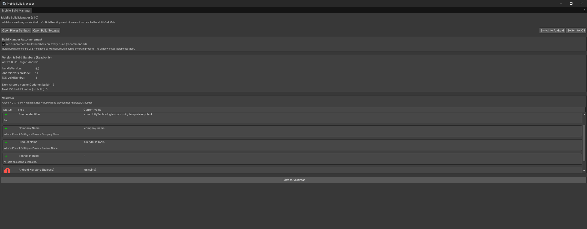

# UnityMobileBuildGate_Tool

A lightweight Unity Editor build gate tool designed to validate mobile build configurations before build.

This tool runs automatically during the build process and checks critical Android and iOS settings.  
If any required configuration is missing or invalid, the build is blocked early with clear error messages.

## What it does
- Validates mobile build requirements before build
- Blocks invalid Android / iOS builds
- Automatically increments build numbers during the build process
- Displays build and version information in a read-only Editor window

## Validated areas
- Bundle Identifier
- Scenes In Build
- Active build target (Android / iOS)
- Android keystore configuration for release builds

## Goal
Prevent common mobile build issues early, reduce failed builds, and make the Unity mobile build process safer and more predictable.

> This tool does not auto-fill settings.  
> It focuses on validation and early failure to protect the build pipeline.

  

